# SICAF - Architecture Documentation

## Introducción

Este documento describe la arquitectura del Sistema Integral de Calificación de Fases de Vuelo (SICAF), un sistema web desarrollado en ASP.NET Core 8.0 con una arquitectura de cinco capas que permite la gestión integral del programa académico de tecnología de aviación policial.

## Arquitectura General del Sistema

### Arquitectura de Cinco Capas

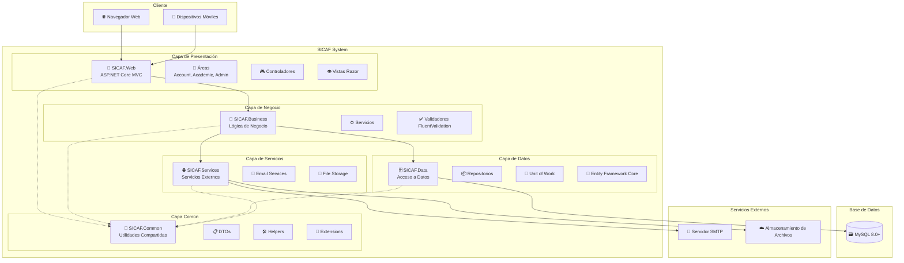

## Arquitectura Detallada por Capas

### Capa de Presentación (SICAF.Web)

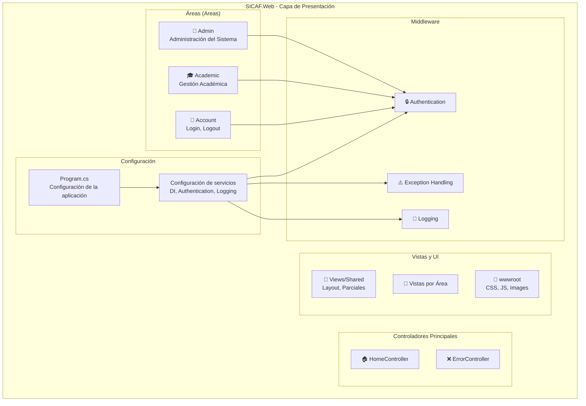

### Capa de Negocio (SICAF.Business)

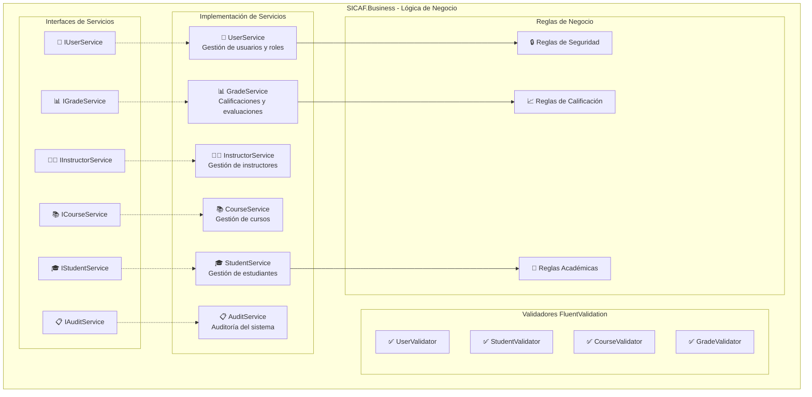

### Capa de Datos (SICAF.Data)

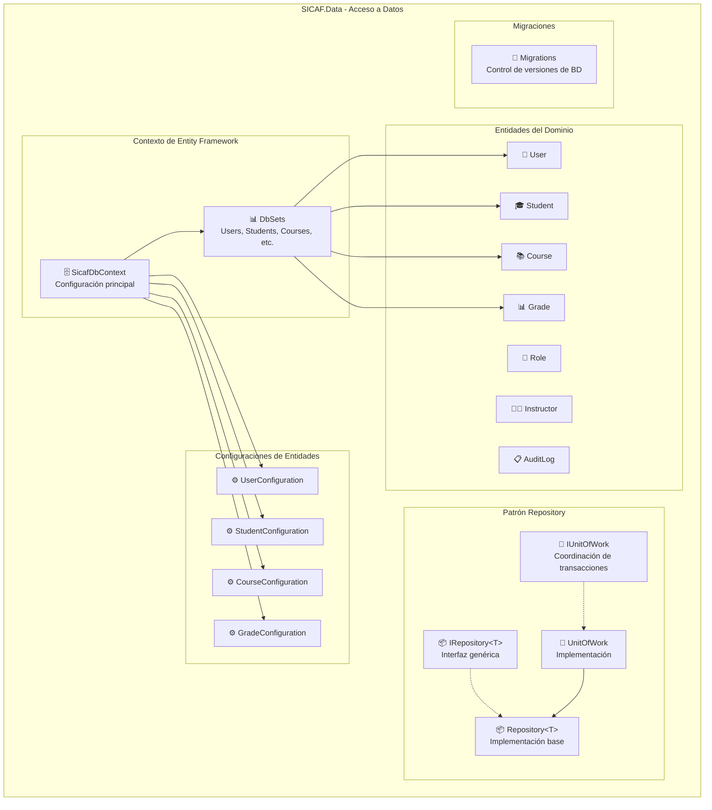

## Modelo de Datos del Sistema

### Diagrama Entidad-Relación

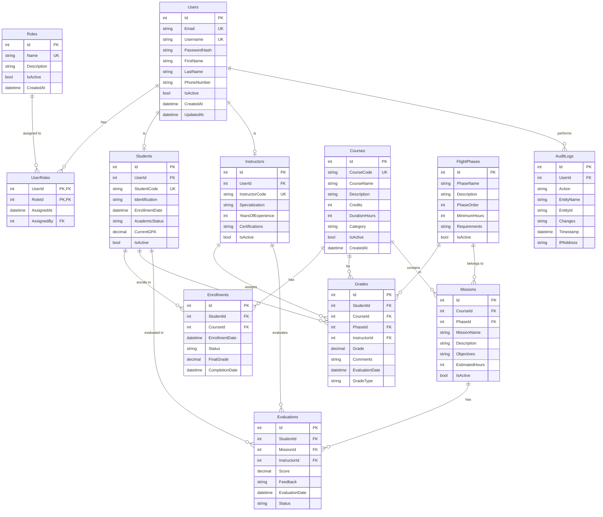

## Flujo de Autenticación y Autorización

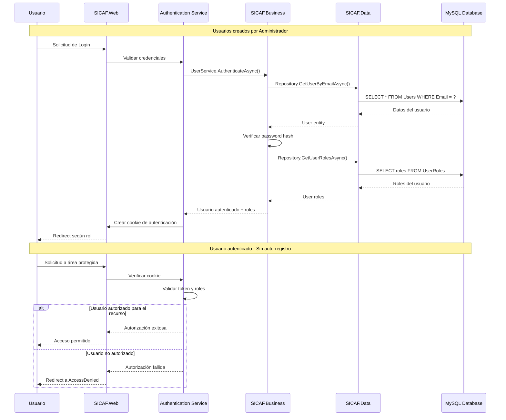

## Casos de Uso por Rol

```mermaid
graph TB
    subgraph "Actores del Sistema"
        Admin["👑 Administrador"]
        AdminUser["👤 Administrador_usuarios"]
        AdminAcad["🎓 Administrador_academico"]
        Seguimiento["📊 Seguimiento_academico"]
        Lider["✈️ Lider_Vuelo"]
        Instructor["👨‍🏫 Instructor"]
        Student["🎓 Estudiante"]
    end
    
    subgraph "Casos de Uso del Sistema"
        subgraph "Gestión de Usuarios"
            CU1["Crear usuarios"]
            CU2["Restablecer contraseñas"]
            CU3["Asignar roles"]
            CU4["Revisar auditoría"]
        end
        
        subgraph "Gestión Académica"
            CU5["Crear cursos"]
            CU6["Crear estudiantes"]
            CU7["Revisar notas estudiante"]
            CU8["Ver progreso estudiante"]
            CU9["Ver informe académico individual"]
            CU10["Ver informe académico colectivo"]
            CU11["Ver notas individuales"]
        end
        
        subgraph "Evaluación y Calificación"
            CU12["Calificar tareas estudiantes"]
            CU13["Calificar misiones estudiantes"]
            CU14["Asignar fase estudiante"]
        end
    end
    
    %% Conexiones Administrador
    Admin --> CU1
    Admin --> CU2
    Admin --> CU3
    Admin --> CU4
    
    %% Conexiones Administrador de Usuarios
    AdminUser --> CU1
    AdminUser --> CU2
    AdminUser --> CU3
    
    %% Conexiones Administrador Académico
    AdminAcad --> CU5
    AdminAcad --> CU6
    
    %% Conexiones Seguimiento Académico
    Seguimiento --> CU7
    Seguimiento --> CU8
    Seguimiento --> CU9
    Seguimiento --> CU10
    Seguimiento --> CU11
    
    %% Conexiones Líder de Vuelo
    Lider --> CU7
    Lider --> CU8
    Lider --> CU9
    Lider --> CU10
    Lider --> CU11
    
    %% Conexiones Instructor
    Instructor --> CU7
    Instructor --> CU8
    Instructor --> CU9
    Instructor --> CU10
    Instructor --> CU11
    Instructor --> CU12
    Instructor --> CU13
    Instructor --> CU14
    
    %% Conexiones Estudiante
    Student --> CU11
```

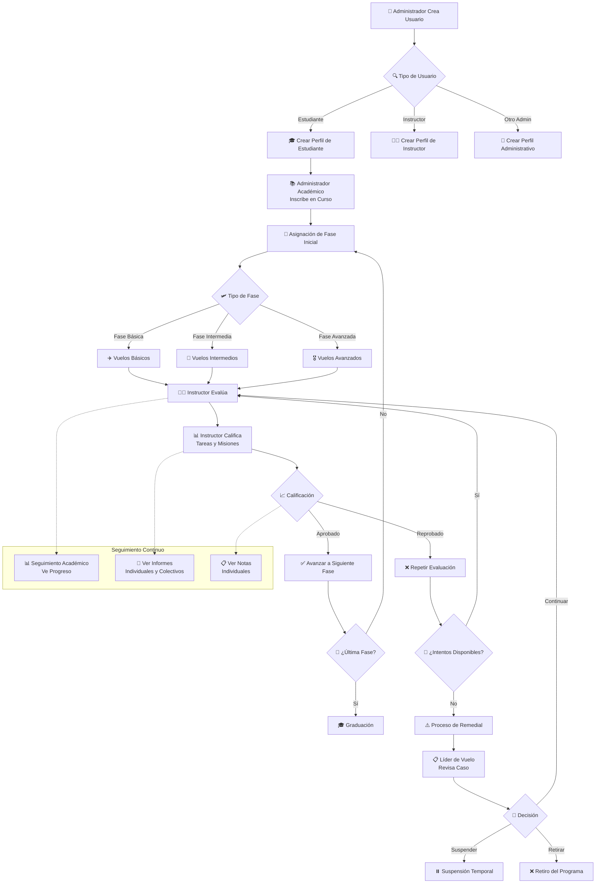

## Arquitectura de Seguridad

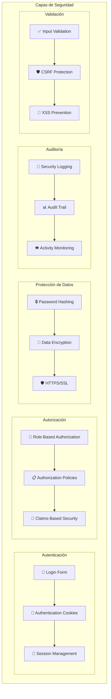

## Patrones de Diseño Implementados

### Patrón Repository y Unit of Work

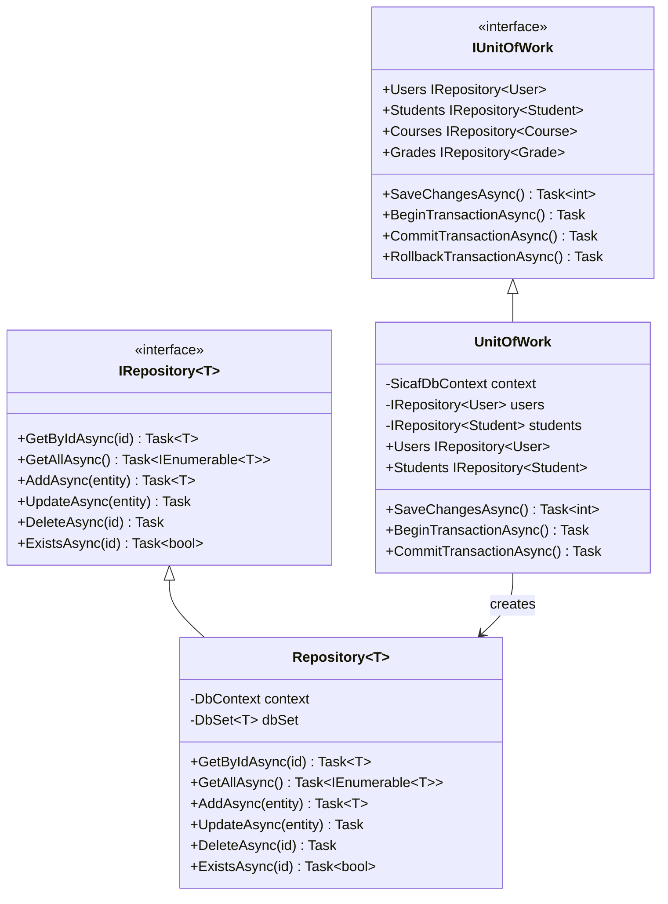

### Patrón Dependency Injection

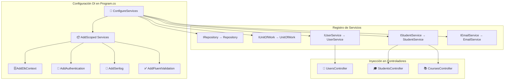

## Flujo de Logging y Monitoreo

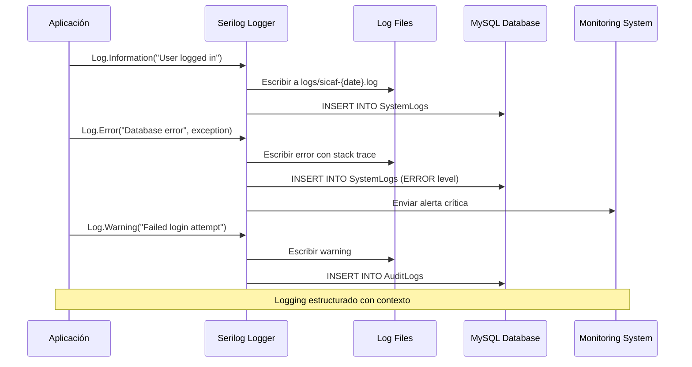

## Despliegue y Infraestructura

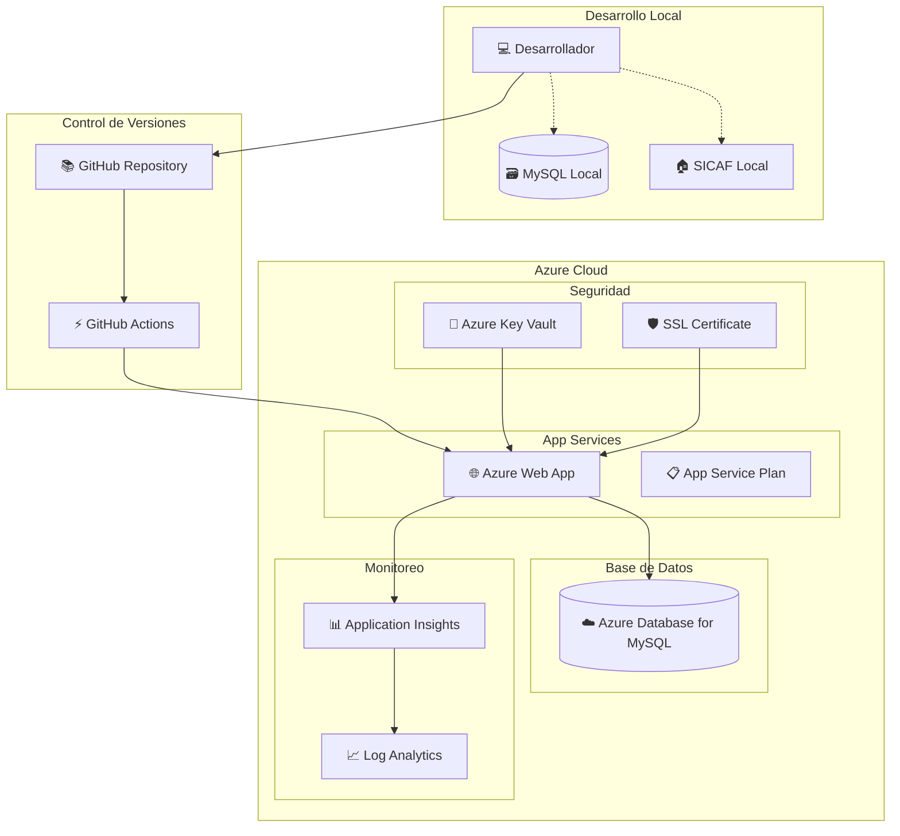

## Consideraciones de Rendimiento

### Estrategias de Optimización

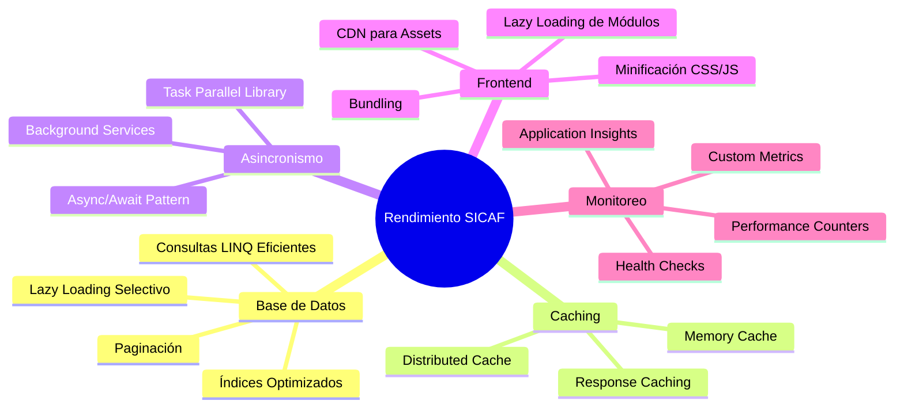

## Conclusión

La arquitectura de SICAF está diseñada para ser:

- **Escalable**: Arquitectura en capas que permite crecimiento horizontal y vertical
- **Mantenible**: Separación clara de responsabilidades y patrones bien establecidos
- **Segura**: Múltiples capas de seguridad y auditoría completa
- **Testeable**: Inyección de dependencias facilita las pruebas unitarias e integración
- **Moderna**: Utiliza las mejores prácticas de .NET 8 y tecnologías actuales

Esta documentación sirve como guía para desarrolladores que trabajen en el proyecto, facilitando la comprensión de la estructura y los flujos del sistema.