# SICAF - Architecture Documentation

## Introducción

Este documento describe la arquitectura del Sistema Integral de Calificación de Fases de Vuelo (SICAF), un sistema web desarrollado en ASP.NET Core 8.0 con una arquitectura de cinco capas que permite la gestión integral del programa académico de tecnología de aviación policial.

## Arquitectura General del Sistema

### Arquitectura de Cinco Capas

## Arquitectura Detallada por Capas

### Capa de Presentación (SICAF.Web)

```mermaid
graph TB
    subgraph "SICAF.Web - Capa de Presentación"
        subgraph "Configuración"
            Program[Program.cs<br/>Configuración de la aplicación]
            Startup[Configuración de servicios<br/>DI, Authentication, Logging]
        end
        
        subgraph "Áreas (Areas)"
            AccountArea["🔐 Account<br/>Login, Logout"]
            AcademicArea["🎓 Academic<br/>Gestión Académica"]
            AdminArea["👑 Admin<br/>Administración del Sistema"]
        end
        
        subgraph "Controladores Principales"
            HomeController[🏠 HomeController]
            ErrorController[❌ ErrorController]
        end
        
        subgraph "Vistas y UI"
            SharedViews[📄 Views/Shared<br/>Layout, Parciales]
            AreaViews[📄 Vistas por Área]
            StaticFiles[🎨 wwwroot<br/>CSS, JS, Images]
        end
        
        subgraph "Middleware"
            AuthMiddleware[🔒 Authentication]
            ErrorMiddleware[⚠️ Exception Handling]
            LoggingMiddleware[📝 Logging]
        end
    end
    
    Program --> Startup
    Startup --> AuthMiddleware
    Startup --> ErrorMiddleware
    Startup --> LoggingMiddleware
    
    AccountArea --> AuthMiddleware
    AcademicArea --> AuthMiddleware
    AdminArea --> AuthMiddleware
```

### Capa de Negocio (SICAF.Business)

```mermaid
graph TB
    subgraph "SICAF.Business - Lógica de Negocio"
        subgraph "Interfaces de Servicios"
            IUserService[👤 IUserService]
            IStudentService[🎓 IStudentService]
            IInstructorService[👨‍🏫 IInstructorService]
            ICourseService[📚 ICourseService]
            IGradeService[📊 IGradeService]
            IAuditService[📋 IAuditService]
        end
        
        subgraph "Implementación de Servicios"
            UserService[👤 UserService<br/>Gestión de usuarios y roles]
            StudentService[🎓 StudentService<br/>Gestión de estudiantes]
            InstructorService[👨‍🏫 InstructorService<br/>Gestión de instructores]
            CourseService[📚 CourseService<br/>Gestión de cursos]
            GradeService[📊 GradeService<br/>Calificaciones y evaluaciones]
            AuditService[📋 AuditService<br/>Auditoría del sistema]
        end
        
        subgraph "Validadores FluentValidation"
            UserValidator[✅ UserValidator]
            StudentValidator[✅ StudentValidator]
            CourseValidator[✅ CourseValidator]
            GradeValidator[✅ GradeValidator]
        end
        
        subgraph "Reglas de Negocio"
            SecurityRules[🔒 Reglas de Seguridad]
            AcademicRules[🎯 Reglas Académicas]
            GradingRules[📈 Reglas de Calificación]
        end
    end
    
    IUserService -.-> UserService
    IStudentService -.-> StudentService
    IInstructorService -.-> InstructorService
    ICourseService -.-> CourseService
    IGradeService -.-> GradeService
    IAuditService -.-> AuditService
    
    UserService --> SecurityRules
    GradeService --> GradingRules
    StudentService --> AcademicRules
```

### Capa de Datos (SICAF.Data)

```mermaid
graph TB
    subgraph "SICAF.Data - Acceso a Datos"
        subgraph "Contexto de Entity Framework"
            SicafContext[🗄️ SicafDbContext<br/>Configuración principal]
            DbSets[📊 DbSets<br/>Users, Students, Courses, etc.]
        end
        
        subgraph "Configuraciones de Entidades"
            UserConfig[⚙️ UserConfiguration]
            StudentConfig[⚙️ StudentConfiguration]
            CourseConfig[⚙️ CourseConfiguration]
            GradeConfig[⚙️ GradeConfiguration]
        end
        
        subgraph "Entidades del Dominio"
            UserEntity[👤 User]
            RoleEntity[🔑 Role]
            StudentEntity[🎓 Student]
            InstructorEntity[👨‍🏫 Instructor]
            CourseEntity[📚 Course]
            GradeEntity[📊 Grade]
            AuditEntity[📋 AuditLog]
        end
        
        subgraph "Patrón Repository"
            IRepository[📦 IRepository&lt;T&gt;<br/>Interfaz genérica]
            Repository[📦 Repository&lt;T&gt;<br/>Implementación base]
            IUnitOfWork[🔄 IUnitOfWork<br/>Coordinación de transacciones]
            UnitOfWork[🔄 UnitOfWork<br/>Implementación]
        end
        
        subgraph "Migraciones"
            Migrations[🔄 Migrations<br/>Control de versiones de BD]
        end
    end
    
    SicafContext --> DbSets
    SicafContext --> UserConfig
    SicafContext --> StudentConfig
    SicafContext --> CourseConfig
    SicafContext --> GradeConfig
    
    DbSets --> UserEntity
    DbSets --> StudentEntity
    DbSets --> CourseEntity
    DbSets --> GradeEntity
    
    IRepository -.-> Repository
    IUnitOfWork -.-> UnitOfWork
    UnitOfWork --> Repository
```

## Modelo de Datos del Sistema

### Diagrama Entidad-Relación

## Flujo de Autenticación y Autorización

```mermaid
sequenceDiagram
    participant U as Usuario
    participant W as SICAF.Web
    participant A as Authentication Service
    participant B as SICAF.Business
    participant D as SICAF.Data
    participant DB as MySQL Database
    
    Note over U,DB: Usuarios creados por Administrador
    
    U->>W: Solicitud de Login
    W->>A: Validar credenciales
    A->>B: UserService.AuthenticateAsync()
    B->>D: Repository.GetUserByEmailAsync()
    D->>DB: SELECT * FROM Users WHERE Email = ?
    DB-->>D: Datos del usuario
    D-->>B: User entity
    B->>B: Verificar password hash
    B->>D: Repository.GetUserRolesAsync()
    D->>DB: SELECT roles FROM UserRoles
    DB-->>D: Roles del usuario
    D-->>B: User roles
    B-->>A: Usuario autenticado + roles
    A->>W: Crear cookie de autenticación
    W-->>U: Redirect según rol
    
    Note over U,DB: Usuario autenticado - Sin auto-registro
    
    U->>W: Solicitud a área protegida
    W->>A: Verificar cookie
    A->>A: Validar token y roles
    alt Usuario autorizado para el recurso
        A-->>W: Autorización exitosa
        W-->>U: Acceso permitido
    else Usuario no autorizado
        A-->>W: Autorización fallida
        W-->>U: Redirect a AccessDenied
    end
```

## Casos de Uso por Rol

```mermaid
graph TB
    subgraph "Actores del Sistema"
        Admin["👑 Administrador"]
        AdminUser["👤 Administrador_usuarios"]
        AdminAcad["🎓 Administrador_academico"]
        Seguimiento["📊 Seguimiento_academico"]
        Lider["✈️ Lider_Vuelo"]
        Instructor["👨‍🏫 Instructor"]
        Student["🎓 Estudiante"]
    end
    
    subgraph "Casos de Uso del Sistema"
        subgraph "Gestión de Usuarios"
            CU1["Crear usuarios"]
            CU2["Restablecer contraseñas"]
            CU3["Asignar roles"]
            CU4["Revisar auditoría"]
        end
        
        subgraph "Gestión Académica"
            CU5["Crear cursos"]
            CU6["Crear estudiantes"]
            CU7["Revisar notas estudiante"]
            CU8["Ver progreso estudiante"]
            CU9["Ver informe académico individual"]
            CU10["Ver informe académico colectivo"]
            CU11["Ver notas individuales"]
        end
        
        subgraph "Evaluación y Calificación"
            CU12["Calificar tareas estudiantes"]
            CU13["Calificar misiones estudiantes"]
            CU14["Asignar fase estudiante"]
        end
    end
    
    %% Conexiones Administrador
    Admin --> CU1
    Admin --> CU2
    Admin --> CU3
    Admin --> CU4
    
    %% Conexiones Administrador de Usuarios
    AdminUser --> CU1
    AdminUser --> CU2
    AdminUser --> CU3
    
    %% Conexiones Administrador Académico
    AdminAcad --> CU5
    AdminAcad --> CU6
    
    %% Conexiones Seguimiento Académico
    Seguimiento --> CU7
    Seguimiento --> CU8
    Seguimiento --> CU9
    Seguimiento --> CU10
    Seguimiento --> CU11
    
    %% Conexiones Líder de Vuelo
    Lider --> CU7
    Lider --> CU8
    Lider --> CU9
    Lider --> CU10
    Lider --> CU11
    
    %% Conexiones Instructor
    Instructor --> CU7
    Instructor --> CU8
    Instructor --> CU9
    Instructor --> CU10
    Instructor --> CU11
    Instructor --> CU12
    Instructor --> CU13
    Instructor --> CU14
    
    %% Conexiones Estudiante
    Student --> CU11
```

```mermaid
flowchart TD
    A["👑 Administrador Crea Usuario"] --> B{"🔍 Tipo de Usuario"}
    B -->|Estudiante| C["🎓 Crear Perfil de Estudiante"]
    B -->|Instructor| D["👨‍🏫 Crear Perfil de Instructor"]
    B -->|Otro Admin| E["👑 Crear Perfil Administrativo"]
    
    C --> F["📚 Administrador Académico<br/>Inscribe en Curso"]
    F --> G["🎯 Asignación de Fase Inicial"]
    
    G --> H{"🛩️ Tipo de Fase"}
    H -->|Fase Básica| I["✈️ Vuelos Básicos"]
    H -->|Fase Intermedia| J["🚁 Vuelos Intermedios"]
    H -->|Fase Avanzada| K["🎖️ Vuelos Avanzados"]
    
    I --> L["👨‍🏫 Instructor Evalúa"]
    J --> L
    K --> L
    
    L --> M["📊 Instructor Califica<br/>Tareas y Misiones"]
    M --> N{"📈 Calificación"}
    N -->|Aprobado| O["✅ Avanzar a Siguiente Fase"]
    N -->|Reprobado| P["❌ Repetir Evaluación"]
    
    O --> Q{"🏁 ¿Última Fase?"}
    Q -->|No| G
    Q -->|Sí| R["🎓 Graduación"]
    
    P --> S{"🔄 ¿Intentos Disponibles?"}
    S -->|Sí| L
    S -->|No| T["⚠️ Proceso de Remedial"]
    
    T --> U["📋 Líder de Vuelo<br/>Revisa Caso"]
    U --> V{"🤔 Decisión"}
    V -->|Continuar| L
    V -->|Suspender| W["⏸️ Suspensión Temporal"]
    V -->|Retirar| X["❌ Retiro del Programa"]
    
    subgraph "Seguimiento Continuo"
        Y["📊 Seguimiento Académico<br/>Ve Progreso"]
        Z["📝 Ver Informes<br/>Individuales y Colectivos"]
        AA["📋 Ver Notas<br/>Individuales"]
    end
    
    L -.-> Y
    M -.-> Z
    N -.-> AA
```

## Arquitectura de Seguridad

```mermaid
graph TB
    subgraph "Capas de Seguridad"
        subgraph "Autenticación"
            Login[🔐 Login Form]
            Cookies[🍪 Authentication Cookies]
            Session[📱 Session Management]
        end
        
        subgraph "Autorización"
            Roles[👥 Role-Based Authorization]
            Policies[📋 Authorization Policies]
            Claims[🎫 Claims-Based Security]
        end
        
        subgraph "Protección de Datos"
            Hash[🔒 Password Hashing]
            Encryption[🔐 Data Encryption]
            SSL[🛡️ HTTPS/SSL]
        end
        
        subgraph "Auditoría"
            Logging[📝 Security Logging]
            Audit[📊 Audit Trail]
            Monitoring[👁️ Activity Monitoring]
        end
        
        subgraph "Validación"
            Input[✅ Input Validation]
            CSRF[🛡️ CSRF Protection]
            XSS[🚫 XSS Prevention]
        end
    end
    
    Login --> Cookies
    Cookies --> Session
    Roles --> Policies
    Policies --> Claims
    Hash --> Encryption
    Encryption --> SSL
    Logging --> Audit
    Audit --> Monitoring
    Input --> CSRF
    CSRF --> XSS
```

## Patrones de Diseño Implementados

### Patrón Repository y Unit of Work

### Patrón Dependency Injection

```mermaid
graph TB
    subgraph "Configuración DI en Program.cs"
        A[🔧 ConfigureServices] --> B[📦 AddScoped Services]
        B --> C[🗄️ AddDbContext]
        B --> D[🔐 AddAuthentication]
        B --> E[📝 AddSerilog]
        B --> F[✅ AddFluentValidation]
    end
    
    subgraph "Registro de Servicios"
        G[IRepository → Repository]
        H[IUnitOfWork → UnitOfWork]
        I[IUserService → UserService]
        J[IStudentService → StudentService]
        K[IEmailService → EmailService]
    end
    
    subgraph "Inyección en Controladores"
        L[👤 UsersController]
        M[🎓 StudentsController]
        N[📚 CoursesController]
    end
    
    A --> G
    A --> H
    A --> I
    A --> J
    A --> K
    
    I --> L
    J --> M
    J --> N
```

## Flujo de Logging y Monitoreo

```mermaid
sequenceDiagram
    participant App as Aplicación
    participant Serilog as Serilog Logger
    participant File as Log Files
    participant DB as MySQL Database
    participant Monitor as Monitoring System
    
    App->>Serilog: Log.Information("User logged in")
    Serilog->>File: Escribir a logs/sicaf-{date}.log
    Serilog->>DB: INSERT INTO SystemLogs
    
    App->>Serilog: Log.Error("Database error", exception)
    Serilog->>File: Escribir error con stack trace
    Serilog->>DB: INSERT INTO SystemLogs (ERROR level)
    Serilog->>Monitor: Enviar alerta crítica
    
    App->>Serilog: Log.Warning("Failed login attempt")
    Serilog->>File: Escribir warning
    Serilog->>DB: INSERT INTO AuditLogs
    
    Note over App,Monitor: Logging estructurado con contexto
```

## Despliegue y Infraestructura

```mermaid
graph TB
    subgraph "Desarrollo Local"
        Dev[💻 Desarrollador]
        LocalDB[(🗃️ MySQL Local)]
        LocalApp[🏠 SICAF Local]
    end
    
    subgraph "Control de Versiones"
        GitHub[📚 GitHub Repository]
        Actions[⚡ GitHub Actions]
    end
    
    subgraph "Azure Cloud"
        subgraph "App Services"
            WebApp[🌐 Azure Web App]
            AppPlan[📋 App Service Plan]
        end
        
        subgraph "Base de Datos"
            AzureDB[(☁️ Azure Database for MySQL)]
        end
        
        subgraph "Monitoreo"
            AppInsights[📊 Application Insights]
            LogAnalytics[📈 Log Analytics]
        end
        
        subgraph "Seguridad"
            KeyVault[🔐 Azure Key Vault]
            SSL[🛡️ SSL Certificate]
        end
    end
    
    Dev --> GitHub
    GitHub --> Actions
    Actions --> WebApp
    WebApp --> AzureDB
    WebApp --> AppInsights
    AppInsights --> LogAnalytics
    KeyVault --> WebApp
    SSL --> WebApp
    
    Dev -.-> LocalDB
    Dev -.-> LocalApp
```

## Consideraciones de Rendimiento

### Estrategias de Optimización

```mermaid
mindmap
  root((Rendimiento SICAF))
    Base de Datos
      Índices Optimizados
      Consultas LINQ Eficientes
      Paginación
      Lazy Loading Selectivo
    Caching
      Memory Cache
      Distributed Cache
      Response Caching
    Asincronismo
      Async/Await Pattern
      Task Parallel Library
      Background Services
    Frontend
      Minificación CSS/JS
      Bundling
      Lazy Loading de Módulos
      CDN para Assets
    Monitoreo
      Application Insights
      Performance Counters
      Health Checks
      Custom Metrics
```

## Conclusión

La arquitectura de SICAF está diseñada para ser:

- **Escalable**: Arquitectura en capas que permite crecimiento horizontal y vertical
- **Mantenible**: Separación clara de responsabilidades y patrones bien establecidos
- **Segura**: Múltiples capas de seguridad y auditoría completa
- **Testeable**: Inyección de dependencias facilita las pruebas unitarias e integración
- **Moderna**: Utiliza las mejores prácticas de .NET 8 y tecnologías actuales

Esta documentación sirve como guía para desarrolladores que trabajen en el proyecto, facilitando la comprensión de la estructura y los flujos del sistema.